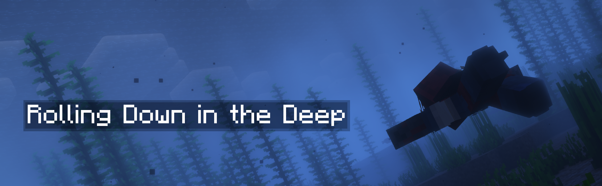
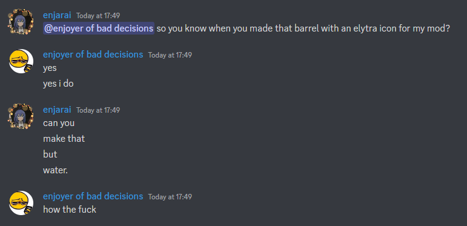
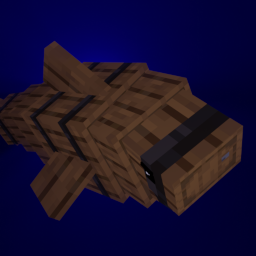

Rolling Down in the Deep is a lightweight, 
fully clientside addon for [Do a Barrel Roll](https://github.com/enjarai/do-a-barrel-roll)
that extends its unlocked camera features to underwater environments.
It redesigns swimming to be more interesting and satisfying by 
giving players full pitch, yaw and roll control.

## Controls

The default controls are as follows, but can be modified:

- Mouse x axis to roll
- Mouse y axis to pitch
- strafe keys (normally A and D) to yaw and strafe at the same time

## Configuration

The mod can be configured in-game using [ModMenu](https://modrinth.com/mod/modmenu) and [YACL](https://modrinth.com/mod/yacl).
Once you install both of these,
you can access the config screen by finding the mod in the mods list and pressing the config button.

Everything this mod does is designed to be as configurable as possible,
so you'll be able to tweak things to your hearts content.
If you think a particular option is missing 
you should definitely open an issue on GitHub or message us on Discord,
it will most likely be added.

## Disclaimer

This mod modifies swimming mechanics significantly, 
which includes allowing players to stay in "swim mode" without moving.
It does this by tricking the server and desyncing with it in a controlled way.
While this works perfectly fine on vanilla servers, and likely will on many others, 
some serverside anticheat might flag it as suspicious.

**Use at your own risk, and when in doubt, check with your server admin.**

## Credits

Made possible with contributions from [CarterKJ](https://github.com/CarterKJ)

Mod icon by Mizeno:

> 
> 
> The result:
>
> 
> 
> I for one, think he did a great job.